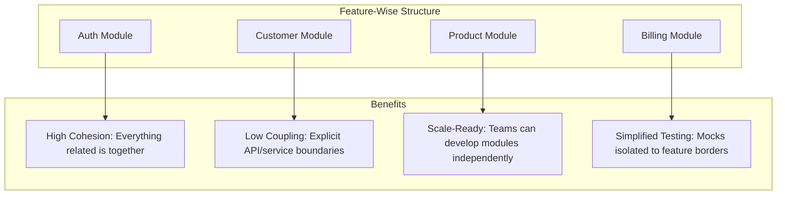
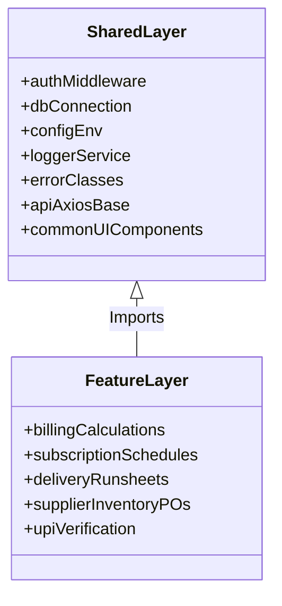
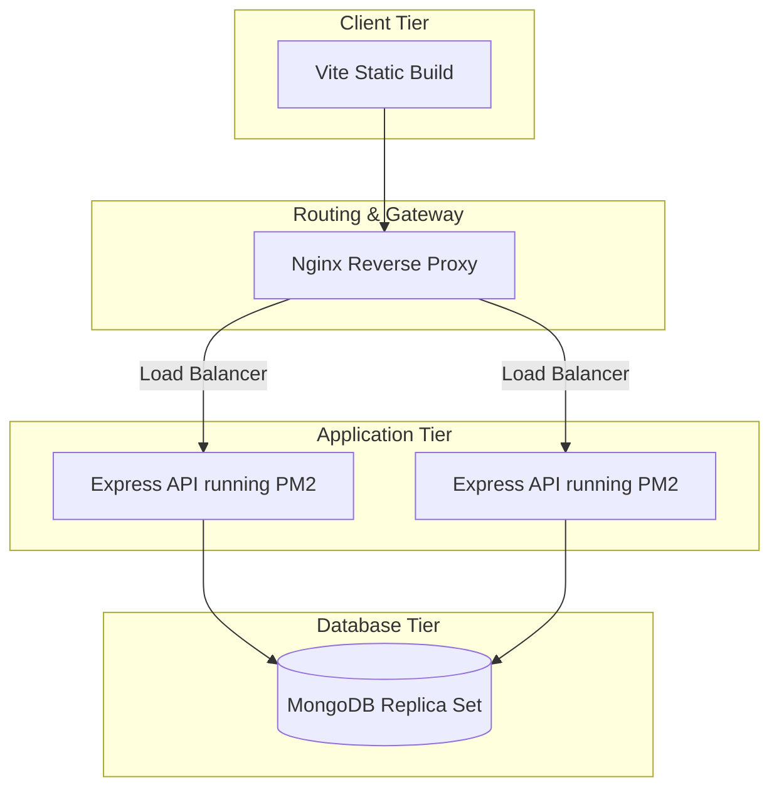

# 🏪 SMART SHOP MANAGEMENT SYSTEM
## FEATURE-WISE CODEBASE REFACTORING & MIGRATION PLAN

---

## 1. Executive Summary

### Current Architecture Quality
The Smart Shop Management System is built using a standard **Model-View-Controller (MVC)** structural pattern on the backend (using Node.js, Express, and Mongoose) and a centralized page-based architecture on the frontend (using React 19, React Router Dom 7, and Tailwind CSS v4). 

While the existing implementation provides working basic features, it displays a classic **horizontal-layer coupling pattern**. Files are organized strictly by their technical function (`controllers/`, `routes/`, `models/`, `pages/`, `components/`) rather than by the business capabilities they deliver.

### Major Structural Issues
1. **High Cognitive Load**: Adding or modifying a single business feature (e.g., adding a field to *Subscriptions*) requires modifying up to six distinct directories widely separated across the filesystem (routes, controllers, models, frontend pages, services, components).
2. **Weak Module Boundaries**: Business logic is scattered. For instance, customer quick-registration resides directly inside the `authController.js` file, blurring the boundaries between Identity/Authentication and Core Customer Management.
3. **Implicit Dependencies**: Inter-module interactions (e.g., placing a bill and immediately deducting stock, or generating subscription schedules) occur directly inside controllers, leading to circular references and making unit testing near impossible.
4. **Fragile State Management**: The frontend relies on global, coarse-grained React Contexts (`AuthContext`, `CartContext`), which triggers excessive re-renders and degrades browser performance as the UI scales.
5. **No Validation Standard**: Input validation is inconsistent—some routes use schema constraints inside Mongoose, others use ad-hoc `if` blocks in controllers, and others lack backend validations entirely, exposing the database to corrupt entries.

### Benefits of the Feature-Wise Architecture
Transitioning to a **Feature-Wise (Vertical Sliced) Architecture** organizes codebase directories by domain module (e.g., `auth`, `products`, `billing`) instead of technical type. This offers several immediate advantages:



* **True Domain Encapsulation**: A developer working on "Subscriptions" stays inside the `subscriptions` folder, where routes, logic, schemas, and UI components live together.
* **Low Coupling, High Cohesion**: Code that changes together is stored together. Modules interact through strictly defined services and interfaces.
* **Safer Refactoring & Feature Additions**: New business features are implemented in isolated directories, ensuring zero regressions to older parts of the system.
* **Production-Grade Scalability**: Preparing the codebase for automated unit testing, robust environment config, and rapid local compilation.

---

## 2. Current Architecture Analysis

The codebase contains a functional setup, which we audit below:

### Backend Architecture Audit
* **Framework**: Node.js v20+ with Express using ES Modules (`"type": "module"` in `package.json`).
* **Routing**: Centralized routing in `backend/server.js` mapping distinct URL prefixes directly to route files in `backend/routes/`.
* **State & DB Connection**: Single connection instance in `backend/config/db.js` using Mongoose, invoked synchronously at boot.
* **Controller Layout**: Exported raw middleware functions utilizing `try-catch` blocks and calling the `next(error)` handler to forward errors.

### Frontend Architecture Audit
* **Framework & Build System**: React 19 powered by Vite 8 with Tailwind CSS v4 for layout styling.
* **Routing System**: React Router Dom v7 with private routes guarded via a centralized `<ProtectedRoute>` component inside `App.jsx`.
* **API Integration**: A base Axios instance defined in `frontend/src/services/api.js` utilizing localStorage token interceptors.
* **UI Organization**: Standard page files inside `src/pages/` containing inline forms, large tailwind blocks, state variables, and fetch logic.

### Database Layer
* **Store**: MongoDB (Atlas) accessed via Mongoose ODM.
* **Schema Design**: Standard models defined inside `backend/models/`. Data integrity is enforced via Mongoose-level validators (e.g., Regex match for email, enum checks for roles).
* **Missing Elements**: Lack of database indexes on high-query fields (e.g., `status` in Orders, `userId` in Subscriptions, `phone` in CustomerProfile) which will cause performance degradation as rows scale.

### Shared Utilities
* **Current Middleware**: A single `authMiddleware.js` verifying JWT tokens and extracting user roles to inject into `req.user`.
* **API Connection**: Single Axios service utilizing request headers to send credentials.
* **Technical Debt Matrix**:

| Component | Technical Debt | Risk Level | Mitigation |
| :--- | :--- | :--- | :--- |
| **Error Handling** | No custom error classes; raw server errors are printed directly to `stderr` and returned as 500 responses. | **Medium** | Build a centralized error hierarchy and mapping middleware. |
| **Data Validation** | Request payloads are parsed directly in controllers without schemas. Missing fields cause schema crashes. | **High** | Introduce Express validation schemas (e.g. using Joi/Zod) before controller logic. |
| **Fat Controllers** | Subscription and billing calculations are written inline inside routes, increasing coupling. | **High** | Extract calculations into standalone, unit-testable Domain Services. |
| **Coupled CSS** | Large chunks of custom inline Tailwind styles without layout or typography tokens. | **Low** | Define a shared Tailwind class dictionary for core UI layout. |

---

## 3. Proposed Feature-Wise Architecture

The goal is to transition both backend and frontend layers to a vertical-slice directory structure. We separate files by business capability while keeping shared, low-level modules in a common layer.

### Target Backend Structure Overview
On the backend, all code is moved into domain modules under a centralized `/modules` directory.

```
backend/
 ├── config/                     # Shared database & environment configs
 ├── middleware/                 # Shared Express middlewares (error, limiters)
 ├── modules/                    # VERTICAL FEATURE SLICES
 │    ├── auth/                  # Authentication Module
 │    │    ├── controllers/      # Route handler functions
 │    │    ├── models/           # Mongoose schemas (User.js)
 │    │    ├── routes/           # Express routes
 │    │    └── services/         # Pure business logic (token generation)
 │    ├── customers/             # Customer Management Module
 │    │    ├── controllers/
 │    │    ├── models/           # CustomerProfile.js
 │    │    ├── routes/
 │    │    └── services/         # Wallet transactions, Address validation
 │    ├── products/              # Product & Inventory Module
 │    ├── billing/               # POS & Sales billing
 │    ├── subscriptions/         # Scheduler & Recurring orders
 │    ├── delivery/              # Run-sheets & Dispatch assignment
 │    ├── suppliers/             # POs & Supplier inventory
 │    ├── payments/              # Payment processing & split registers
 │    └── notifications/         # Mail templates & Notification dispatch
 └── server.js                   # Application bootstrap & route assembly
```

### Target Frontend Structure Overview
On the frontend, pages, state-hooks, API services, and unique components are grouped by business capability inside a `/features` folder.

```
frontend/
 ├── src/
 │    ├── assets/                # Global static assets (logos, icons)
 │    ├── components/            # SHARED/COMMON UI CONTROLS (Atomic design)
 │    │    ├── ui/               # Core Design Tokens (Button, Input, Badge)
 │    │    ├── layout/           # Shared structures (Navbar, Sidebar, Footer)
 │    │    └── ProtectedRoute.js # Global Router guards
 │    ├── features/              # VERTICAL FEATURE SLICES
 │    │    ├── auth/             # Authentication & Profiles
 │    │    │    ├── components/  # LoginForm, RegisterForm
 │    │    │    ├── pages/       # LoginPage, RegisterPage
 │    │    │    ├── services/    # apiAuth.js (Axios endpoints)
 │    │    │    └── hooks/       # useAuth hook
 │    │    ├── customers/        # Customer lists, Wallet histories
 │    │    ├── products/         # Products, categories, low-stock thresholds
 │    │    ├── billing/          # POS Terminal, receipt downloads
 │    │    ├── subscriptions/    # Recurring list managers, pause sliders
 │    │    ├── delivery/         # Run-sheets, staff updates
 │    │    ├── payments/         # UPI inputs, split payment widgets
 │    │    └── reports/          # Analytics dashboards, profit-loss graphs
 │    ├── shared/                # Global React contexts & common helpers
 │    │    ├── context/          # Global Contexts (Theme, AppConfig)
 │    │    ├── services/         # api.js (Axios Base Instance)
 │    │    └── utils/            # formatters.js (currency, date parsers)
 │    ├── App.jsx                # Layout binding & Routing tree
 │    └── main.jsx               # Entry-point mount
```

### Module Isolation Architecture
To keep dependencies clean, modules must follow a strict **Import Dependency Rule**:
* A module's controllers can only import files from its *own* module or from the shared layer.
* When Module A requires logic from Module B, it **must** import Module B's exported Service, never its database Models or Controllers directly.
* Circular imports between modules are strictly forbidden. If Module A and Module B depend on each other, the shared logic must be extracted to the shared layer or resolved using an event emitter.

```
[Module A: Billing] ──(Calls)──> [Module B: Inventory Service] ──(Queries)──> [Product Model]
```

---

## 4. Module Boundary Definitions

This section defines the exact scope, business responsibilities, APIs, database ownership, and dependencies of each target module.

---

### 🔑 1. Authentication & Role Management Module
* **Responsibilities**: Identity provisioning, session management, password hashing, and role checks (Admin, Manager, Staff, Customer).
* **Database Models**: `User.js` (System credentials, permissions, and roles).
* **Backend APIs**:
  * `POST /api/auth/register` (Public customer registration)
  * `POST /api/auth/login` (Token generation & session tracking)
  * `GET /api/auth/me` (Identity recovery)
  * `POST /api/auth/forgot-password` (Secure token generator)
  * `POST /api/auth/change-password` (Active session update)
* **Frontend Pages/Views**: `Login.jsx`, `Register.jsx`.
* **State Management**: Encapsulated within `AuthContext.jsx` & `useAuth.js`.
* **Shared Dependencies**: Database Config, CORS, JWT, BcryptJS.

---

### 👥 2. Customer Management Module
* **Responsibilities**: Customer profiles, address books (primary, delivery, tagged locations), wallet balances, transaction ledgers, purchase history audits.
* **Database Models**: `CustomerProfile.js` (Addresses array, unique ID, wallet balance, transaction logs).
* **Backend APIs**:
  * `POST /api/customers` (Create a profile - Admin/Staff)
  * `GET /api/customers` (List customers with pagination - Admin/Manager)
  * `GET /api/customers/:id` (Fetch details, purchase logs, and addresses)
  * `PUT /api/customers/:id` (Update profile/addresses - Customer/Admin)
  * `GET /api/customers/:id/wallet` (Get wallet ledger & transaction logs)
* **Frontend Pages/Views**: Customer list dashboard (Admin), customer portal profile and address page, wallet view.
* **State Management**: Localized state hooks for forms and addresses.
* **Shared Dependencies**: `auth` (verifies customer ownership).

---

### 📦 3. Product & Inventory Management Module
* **Responsibilities**: Catalog CRUD, brand/category filters, image hosting, tax rates (GST), subscription flags, low-stock threshold triggers, real-time stock ledger, and manual adjustments.
* **Database Models**: `Product.js` (Catalog properties, minimum stock warning level, current inventory, active status).
* **Backend APIs**:
  * `GET /api/products` (Filtered catalog view - Public/Customer)
  * `POST /api/products` (Catalog add - Admin/Manager)
  * `PUT /api/products/:id` (Edit specifications & stock adjustments - Admin/Staff)
  * `DELETE /api/products/:id` (Soft delete/Deactivate - Admin)
* **Frontend Pages/Views**: `Products.jsx` (Admin/Manager CRUD catalog), customer shop grid (`Shop.jsx`).
* **State Management**: Filtering hooks, catalog search state.
* **Shared Dependencies**: File uploader service, `settings` (GST configuration).

---

### 🧾 4. Sales & Billing Module (POS)
* **Responsibilities**: Multi-item POS billing terminal, invoice calculations (discounts, taxes), PDF receipt generation, refunds, and order cancellations.
* **Database Models**: `Order.js` (POS invoices, order status, item detail structures).
* **Backend APIs**:
  * `POST /api/orders` (POS checkout - Admin/Staff)
  * `GET /api/orders` (Sales invoice index - Admin/Manager)
  * `GET /api/orders/:id/invoice` (Generate and stream print-ready PDF invoice)
  * `POST /api/orders/:id/refund` (Full/partial item return and refund)
* **Frontend Pages/Views**: `StoreOrders.jsx` (Admin/Manager sales list), checkout screen (`Checkout.jsx`), user shopping cart (`Cart.jsx`).
* **State Management**: `CartContext.jsx` (managing localized temporary cart).
* **Shared Dependencies**: `products` (for price lookup), `inventory` (auto-deducts stock), PDFkit/Puppeteer for receipt rendering.

---

### 🔄 5. Auto-Delivery & Subscription Module
* **Responsibilities**: Customer subscription scheduling (daily, alternate, custom weekdays), cron-scheduled auto-order generation, and monthly consolidated invoice generation.
* **Database Models**: `Subscription.js` (Customer reference, products, frequency calendar, active status, start/end dates, pause intervals).
* **Backend APIs**:
  * `POST /api/subscriptions` (Create schedule - Customer only)
  * `GET /api/subscriptions/my` (List subscriptions - Customer)
  * `PUT /api/subscriptions/:id/status` (Pause, resume, or skip dates)
  * `GET /api/subscriptions` (Comprehensive active list - Admin/Manager)
  * `POST /api/subscriptions/trigger-scheduler` (Manually invoke auto-order engine)
* **Frontend Pages/Views**: `MySubscriptions.jsx` (Customer calendar dashboard), `AdminSubscriptions.jsx` (Operations management).
* **State Management**: Calendar hooks, pause sliders, skip modals.
* **Shared Dependencies**: `products` (verify eligibility), `billing` (generate invoices), `delivery` (auto run-sheet allocation).

---

### 🚚 6. Delivery Management Module
* **Responsibilities**: Dispatch management, daily run-sheets, delivery staff assignments, real-time status updates (packed, out for delivery, delivered, failed, skipped), and delivery history audits.
* **Database Models**: Extends `Order.js` fields or uses a standalone run-sheet ledger (e.g., `DeliveryRun.js`).
* **Backend APIs**:
  * `GET /api/delivery/daily` (Retrieve daily run-sheets - Staff/Admin)
  * `PUT /api/delivery/:id/status` (Update delivery status - Driver/Staff)
  * `PUT /api/delivery/:id/assign` (Assign driver to order - Admin)
* **Frontend Pages/Views**: Driver delivery run-sheet app view, Admin delivery dashboard.
* **State Management**: Local state with background geolocation update hooks.
* **Shared Dependencies**: `orders` (reference structure), Map services (for routing).

---

### 🧑‍💼 7. Supplier & Purchase Module
* **Responsibilities**: Supplier profiles, Purchase Orders (PO), recording supplier invoices, auto-updating stock on receipt, and tracking outstanding balances.
* **Database Models**: `Supplier.js` (Company info, PO log structures, balance registers).
* **Backend APIs**:
  * `GET /api/suppliers` (List suppliers - Admin)
  * `POST /api/suppliers` (Add profile - Admin)
  * `POST /api/suppliers/:id/purchase-orders` (Draft PO - Admin/Manager)
  * `PUT /api/suppliers/purchase-orders/:poId/receive` (Mark received & auto-increment inventory)
* **Frontend Pages/Views**: Supplier CRUD dashboard, PO generator view.
* **State Management**: Local state with PO draft caching.
* **Shared Dependencies**: `products` (referencing catalogs), `inventory` (adding inventory).

---

### 💳 8. Payment Management Module
* **Responsibilities**: Cash, UPI, and split payment tracking; processing transaction ID references for digital validations; and managing monthly subscription consolidated balances.
* **Database Models**: `Payment.js` (Linked invoice reference, payment mode, unique Transaction ID, transaction timestamp, payment status).
* **Backend APIs**:
  * `POST /api/payments/verify` (Log and verify UPI transaction IDs)
  * `POST /api/payments/split` (Process cash + UPI split payments)
  * `GET /api/payments/logs` (Audit log of financial transactions)
* **Frontend Pages/Views**: Payment input wizard, UPI validator, cashier drawer logs.
* **State Management**: Payment flow sequence hooks.
* **Shared Dependencies**: `billing` (invoice linking), `customers` (wallet updates).

---

### 📊 9. Reports & Analytics Module
* **Responsibilities**: Compiling sales reports (daily/monthly), profit & loss calculations, inventory valuation, subscription revenue, and top-selling product analyses.
* **Database Models**: Reads aggregates across `Order.js`, `Payment.js`, `Product.js`, and `Subscription.js`.
* **Backend APIs**:
  * `GET /api/reports/dashboard` (Summary metrics for Admin)
  * `GET /api/reports/sales` (Sales metrics with date-range filters)
  * `GET /api/reports/inventory-valuation` (Real-time valuation of stock)
  * `GET /api/reports/subscriptions` (Subscription retention and revenue metrics)
* **Frontend Pages/Views**: Dashboard metric charts (`Dashboard.jsx`), report export center.
* **State Management**: Chart data hooks.
* **Shared Dependencies**: Chart.js / Recharts, Excel/CSV export utilities.

---

### 🔔 10. Notifications & Alerts Module
* **Responsibilities**: Sending transactional emails (SMTP), dashboard notification alerts, low-stock triggers, payment reminders, and order confirmations.
* **Database Models**: `Notification.js` (Target user reference, message, priority, read status, channel).
* **Backend APIs**:
  * `GET /api/notifications` (Unread notifications list)
  * `PUT /api/notifications/:id/read` (Mark single notification as read)
  * `POST /api/notifications/clear` (Clear notification tray)
* **Frontend Pages/Views**: Header notification drawer, dashboard alert banners.
* **State Management**: Polling hooks or WebSocket event hooks.
* **Shared Dependencies**: Nodemailer (SMTP service).

---

### 🛠️ 11. System Settings Module
* **Responsibilities**: Global store hours, GST configurations, delivery fees, minimum order thresholds, and platform-wide feature toggles.
* **Database Models**: `Settings.js` (Single document containing global system configs).
* **Backend APIs**:
  * `GET /api/settings` (Public configuration parameters)
  * `PUT /api/settings` (Update configurations - Admin only)
* **Frontend Pages/Views**: System configuration console (Admin only).
* **State Management**: Config context cache.
* **Shared Dependencies**: None.

---

## 5. Code Migration Map

This migration map provides a step-by-step plan for reorganizing the existing files into their new, feature-based directories.

### 5.1 Backend Migration Mapping

| Current File/Folder | Target Vertical Location | Refactor Category | Notes |
| :--- | :--- | :--- | :--- |
| `backend/config/db.js` | `backend/config/db.js` | **Preserve** | Keeps unified database connection in the shared layer. |
| `backend/middleware/authMiddleware.js` | `backend/middleware/authMiddleware.js` | **Split & Shared** | Maintain global authorization, export role validators. |
| `backend/models/User.js` | `backend/modules/auth/models/User.js` | **Isolate** | Encapsulate user credential schema inside the `auth` module. |
| `backend/models/CustomerProfile.js` | `backend/modules/customers/models/CustomerProfile.js` | **Isolate** | Move customer-specific fields (addresses, wallet) to `customers`. |
| `backend/models/Product.js` | `backend/modules/products/models/Product.js` | **Isolate** | Move catalog and stock fields to `products`. |
| `backend/models/Order.js` | `backend/modules/billing/models/Order.js` | **Rename & Isolate** | Rename to Billing/Orders. Tracks POS & delivery checkout details. |
| `backend/models/Subscription.js` | `backend/modules/subscriptions/models/Subscription.js` | **Isolate** | Move schedules and skip dates schema to `subscriptions`. |
| `backend/models/Supplier.js` | `backend/modules/suppliers/models/Supplier.js` | **Isolate** | Move supplier catalog schema to `suppliers`. |
| `backend/models/Payment.js` | `backend/modules/payments/models/Payment.js` | **Isolate** | Move payment records schema to `payments`. |
| `backend/models/Notification.js` | `backend/modules/notifications/models/Notification.js` | **Isolate** | Move transaction logs and notifications to `notifications`. |
| `backend/models/Settings.js` | `backend/modules/settings/models/Settings.js` | **Isolate** | Move configuration fields to `settings`. |
| `backend/controllers/authController.js` | `backend/modules/auth/controllers/auth.controller.js` | **Split** | Keep session register/login here. Move `registerQuickCustomer` to Customer Module. |
| `backend/controllers/customerController.js` | `backend/modules/customers/controllers/customer.controller.js` | **Merge & Refactor** | Add profile logic. Integrate `registerQuickCustomer` logic from Auth Controller. |
| `backend/controllers/productController.js` | `backend/modules/products/controllers/product.controller.js` | **Extract Stock** | Maintain catalog CRUD. Move stock alerts logic to `inventory`. |
| `backend/controllers/orderController.js` | `backend/modules/billing/controllers/billing.controller.js` | **Extract POS** | Focus on POS checkout logic. Extract run-sheet generation to Delivery Module. |
| `backend/controllers/subscriptionController.js`| `backend/modules/subscriptions/controllers/sub.controller.js` | **Extract Engine** | Move the raw daily scheduler logic out of the controller into a Domain Service. |
| `backend/controllers/supplierController.js` | `backend/modules/suppliers/controllers/supplier.controller.js` | **Refactor** | Integrate inventory stock additions directly. |
| `backend/controllers/paymentController.js` | `backend/modules/payments/controllers/payment.controller.js` | **Refactor** | Process transactions and verify transaction IDs here. |
| `backend/controllers/notificationController.js`| `backend/modules/notifications/controllers/notif.controller.js`| **Refactor** | Log and read notifications. |
| `backend/controllers/settingsController.js` | `backend/modules/settings/controllers/settings.controller.js` | **Preserve** | Manage configurations. |
| `backend/routes/*Routes.js` | `backend/modules/[feature]/routes/*.routes.js` | **Isolate** | Map backend routes directly inside their respective vertical modules. |

---

### 5.2 Frontend Migration Mapping

| Current File/Folder | Target Vertical Location | Refactor Category | Notes |
| :--- | :--- | :--- | :--- |
| `frontend/src/context/AuthContext.jsx`| `frontend/src/shared/context/AuthContext.jsx` | **Shared State** | Keep authentication globally accessible in the shared layer. |
| `frontend/src/context/CartContext.jsx`| `frontend/src/features/billing/context/CartContext.jsx`| **Isolate State** | Move the shopping cart context closer to the Billing/Sales module. |
| `frontend/src/components/ProtectedRoute.jsx`| `frontend/src/components/ProtectedRoute.jsx` | **Preserve** | Keep global route guards in the shared components directory. |
| `frontend/src/components/Navbar.jsx` | `frontend/src/components/layout/Navbar.jsx` | **Shared Layout** | Relocate layout elements to `components/layout`. |
| `frontend/src/components/SubscriptionModal.jsx`| `frontend/src/features/subscriptions/components/SubModal.jsx` | **Isolate UI** | Move the subscription modal to the subscriptions directory. |
| `frontend/src/pages/Login.jsx` | `frontend/src/features/auth/pages/Login.jsx` | **Isolate** | Move login page to the `auth` module. |
| `frontend/src/pages/Register.jsx` | `frontend/src/features/auth/pages/Register.jsx` | **Isolate** | Move register page to the `auth` module. |
| `frontend/src/pages/Dashboard.jsx` | `frontend/src/features/reports/pages/Dashboard.jsx` | **Isolate** | Convert index metrics screen to a reporting page. |
| `frontend/src/pages/Shop.jsx` | `frontend/src/features/products/pages/Shop.jsx` | **Isolate** | Move the customer shopping grid to the `products` directory. |
| `frontend/src/pages/Products.jsx` | `frontend/src/features/products/pages/Products.jsx` | **Isolate** | Move the admin catalog CRUD page to the `products` directory. |
| `frontend/src/pages/Cart.jsx` | `frontend/src/features/billing/pages/Cart.jsx` | **Isolate** | Move the shopping cart page to the `billing` directory. |
| `frontend/src/pages/Checkout.jsx` | `frontend/src/features/billing/pages/Checkout.jsx` | **Isolate** | Move checkout logic and split UPI billing page to `billing`. |
| `frontend/src/pages/MyOrders.jsx` | `frontend/src/features/billing/pages/MyOrders.jsx` | **Isolate** | Move customer order logs to the `billing` directory. |
| `frontend/src/pages/StoreOrders.jsx` | `frontend/src/features/billing/pages/StoreOrders.jsx` | **Isolate** | Move admin sales management page to the `billing` directory. |
| `frontend/src/pages/MySubscriptions.jsx` | `frontend/src/features/subscriptions/pages/MySubs.jsx` | **Isolate** | Move customer calendar dashboard to `subscriptions`. |
| `frontend/src/pages/AdminSubscriptions.jsx`| `frontend/src/features/subscriptions/pages/AdminSubs.jsx`| **Isolate** | Move operations management page to `subscriptions`. |
| `frontend/src/services/api.js` | `frontend/src/shared/services/api.js` | **Preserve** | Keep the base Axios instance in the shared layer. |

---

## 6. Shared vs Feature-Specific Boundaries

To avoid dependency tangles, we establish clear boundaries between what is shared globally and what must remain isolated within specific features.



### Shared / Common Boundaries (Global Layer)
The shared layer contains infrastructure utilities and foundational components that do not contain feature-specific business logic:
* **Authentication Middleware**: Verifying JWT tokens and parsing user claims.
* **Database Connection**: Managing the central Mongoose/MongoDB connection pool.
* **Global Configs**: Reading and parsing environment variables (`process.env`).
* **Centralized Logger**: Logging activities, HTTP logs, and formatting errors.
* **Generic UI Controls**: Foundational Tailwind-styled components (buttons, input fields, tables).
* **Core Error Handlers**: Custom error classes and global Express error catchers.
* **Base Axios Client**: Single HTTP agent instance with request-token interceptors.

### Feature-Specific Boundaries (Isolated Layer)
Feature-specific directories contain all the UI, business logic, and API endpoints for a single domain capability:
* **Billing & POS Logic**: Tax calculations, invoice totals, and coupon validations.
* **Subscription Scheduling**: Managing frequencies, pause statuses, vacation modes, and skipped dates.
* **Delivery Runsheets**: Generating run-sheets, assigning delivery drivers, and driver updates.
* **Supplier Orders**: Generating Purchase Orders and managing supplier catalogs.
* **UPI Validation**: Logging and verifying customer-submitted digital transaction IDs.

> [!IMPORTANT]
> **Refactoring Rule**: Feature-specific modules must not import code directly from other feature-specific modules. If a feature needs access to shared data, it must use the shared layer or a cleanly exported Service interface.

---

## 7. Phase-Wise Refactoring Plan

We break the migration down into five sequential phases to ensure the application remains stable and testable throughout the refactoring process.

---

### Phase 1 — Foundation & Shared Infrastructure

```
Goal: Set up the folder structures and establish the shared infrastructure layer.
```

* **Files Impacted**:
  * `backend/server.js` (refactored to load from `/modules`)
  * `backend/config/*` & `backend/middleware/*`
  * `frontend/src/shared/*`
* **Migration Steps**:
  1. Create the new directory layouts on the filesystem (modules, features, shared folders).
  2. Implement custom global error-handling classes (`AppError`, `NotFoundError`, `BadRequestError`) on the backend.
  3. Set up the centralized logger (Morgan + Winston) to output structured JSON logs.
  4. Move core UI components and the base Axios client into the frontend shared layer.
* **Migration Risks**: Breaking database connections or global route configurations.
* **Dependencies**: None.
* **Testing Requirements**:
  * Verify that `GET /api/health` returns successfully.
  * Verify that unhandled routes are caught by the new global error handler and return consistent JSON errors.

---

### Phase 2 — Identity & Customer Access Control

```
Goal: Migrate the Authentication and Customer modules to secure user sessions and route permissions.
```

* **Files Impacted**:
  * `backend/models/User.js` -> `backend/modules/auth/models/User.js`
  * `backend/models/CustomerProfile.js` -> `backend/modules/customers/models/CustomerProfile.js`
  * `backend/controllers/authController.js` & `backend/controllers/customerController.js`
  * `frontend/src/pages/Login.jsx` & `frontend/src/pages/Register.jsx`
* **Migration Steps**:
  1. Move authentication models, controllers, and routes to `backend/modules/auth/`.
  2. Move customer profile logic to `backend/modules/customers/`.
  3. Extract `registerQuickCustomer` from the auth controller and place it in the customer controller.
  4. Set up role-based route protection on both the frontend and backend.
* **Migration Risks**: Locking users out of the system due to broken token verification or route protection.
* **Dependencies**: Completion of Phase 1.
* **Testing Requirements**:
  * Test login, registration, and password changes.
  * Verify that customers cannot access manager routes and that staff permissions are correctly enforced.

---

### Phase 3 — Products & Real-Time Inventory

```
Goal: Migrate the Product and Inventory modules to establish the product catalog and track stock movements.
```

* **Files Impacted**:
  * `backend/models/Product.js` -> `backend/modules/products/models/Product.js`
  * `backend/controllers/productController.js` -> `backend/modules/products/controllers/product.controller.js`
  * `frontend/src/pages/Products.jsx` & `frontend/src/pages/Shop.jsx`
* **Migration Steps**:
  1. Relocate catalog schemas, controllers, and routes to the `products` directory.
  2. Extract inventory stock tracking and low-stock alerts into a dedicated inventory service within the product module.
  3. Implement backend validation for product uploads (valid numbers, required categories).
  4. Migrate the customer-facing store grid and admin catalog dashboards on the frontend.
* **Migration Risks**: Missing inventory updates when orders are placed or products are modified.
* **Dependencies**: Completion of Phase 2.
* **Testing Requirements**:
  * Verify full CRUD operations on products.
  * Verify that catalog filters (category, stock, search) function correctly on both the client and server.

---

### Phase 4 — Orders, POS, Payments & Deliveries

```
Goal: Migrate the Billing, Orders, Payments, and Delivery modules to run sales transactions and track delivery routes.
```

* **Files Impacted**:
  * `backend/models/Order.js` & `backend/models/Payment.js`
  * `backend/controllers/orderController.js` & `backend/controllers/paymentController.js`
  * `frontend/src/pages/Cart.jsx`, `frontend/src/pages/Checkout.jsx`, `frontend/src/pages/StoreOrders.jsx`
* **Migration Steps**:
  1. Relocate billing, payment, and delivery files to their respective modules.
  2. Integrate the POS terminal on the frontend with the payment processor to support split-payment validation (Cash + UPI).
  3. Implement automatic stock deduction on successful POS transactions.
  4. Create delivery run-sheets on order completion and support status updates for delivery staff.
* **Migration Risks**: Inventory counts getting out of sync or payments failing to associate with invoices.
* **Dependencies**: Completion of Phase 3.
* **Testing Requirements**:
  * Walk through the entire POS checkout flow using split payments.
  * Verify that inventory levels are automatically decremented on purchase and restored on refunds/cancellations.

---

### Phase 5 — Subscription Engine, Notifications & Reports

```
Goal: Migrate the Subscription Engine, Notification alerts, and Business Reports dashboards.
```

* **Files Impacted**:
  * `backend/models/Subscription.js` & `backend/models/Notification.js`
  * `backend/controllers/subscriptionController.js` & `backend/controllers/notificationController.js`
  * `frontend/src/pages/MySubscriptions.jsx`, `frontend/src/pages/AdminSubscriptions.jsx`, `frontend/src/pages/Dashboard.jsx`
* **Migration Steps**:
  1. Relocate subscription, notification, and reporting files to their new modules.
  2. Extract the daily scheduler loop out of the subscription controller into a dedicated service.
  3. Connect the scheduler to the notification engine to trigger automatic email alerts.
  4. Implement data aggregation pipelines on the backend to feed data to the reporting dashboard.
* **Migration Risks**: Broken cron jobs leading to skipped daily subscription order generation.
* **Dependencies**: Completion of Phase 4.
* **Testing Requirements**:
  * Manually trigger the daily scheduler and verify that auto-orders are successfully generated, inventory is deducted, and delivery run-sheets are updated.
  * Verify that all dashboard charts display accurate calculations for profit and loss, sales history, and subscription revenue.

---

## 8. Final Target Folder Structure

This is the target folder structure for the fully refactored application:

```
Smart-Shop-Management-System/
 ├── backend/
 │    ├── config/
 │    │    ├── db.js                     # Centralized MongoDB connection
 │    │    └── index.js                  # Loads environment configurations safely
 │    ├── middleware/
 │    │    ├── auth.js                   # Verifies tokens and parses roles
 │    │    ├── error.js                  # Catches and formats backend exceptions
 │    │    └── validate.js               # Validates request payloads
 │    ├── modules/
 │    │    ├── auth/
 │    │    │    ├── controllers/
 │    │    │    │    └── auth.controller.js
 │    │    │    ├── models/
 │    │    │    │    └── User.js
 │    │    │    ├── routes/
 │    │    │    │    └── auth.routes.js
 │    │    │    └── services/
 │    │    │         └── token.service.js
 │    │    ├── customers/
 │    │    │    ├── controllers/
 │    │    │    │    └── customer.controller.js
 │    │    │    ├── models/
 │    │    │    │    └── CustomerProfile.js
 │    │    │    ├── routes/
 │    │    │    │    └── customer.routes.js
 │    │    │    └── services/
 │    │    │         └── wallet.service.js
 │    │    ├── products/
 │    │    │    ├── controllers/
 │    │    │    │    └── product.controller.js
 │    │    │    ├── models/
 │    │    │    │    └── Product.js
 │    │    │    ├── routes/
 │    │    │    │    └── product.routes.js
 │    │    │    └── services/
 │    │    │         └── inventory.service.js
 │    │    ├── billing/
 │    │    │    ├── controllers/
 │    │    │    │    └── billing.controller.js
 │    │    │    ├── routes/
 │    │    │    │    └── billing.routes.js
 │    │    │    └── services/
 │    │    │         └── invoice.service.js
 │    │    ├── subscriptions/
 │    │    │    ├── controllers/
 │    │    │    │    └── sub.controller.js
 │    │    │    ├── routes/
 │    │    │    │    └── sub.routes.js
 │    │    │    └── services/
 │    │    │         └── scheduler.service.js
 │    │    ├── delivery/
 │    │    │    ├── controllers/
 │    │    │    │    └── delivery.controller.js
 │    │    │    └── routes/
 │    │    │         └── delivery.routes.js
 │    │    ├── suppliers/
 │    │    │    ├── controllers/
 │    │    │    │    └── supplier.controller.js
 │    │    │    └── routes/
 │    │    │         └── supplier.routes.js
 │    │    ├── payments/
 │    │    │    ├── controllers/
 │    │    │    │    └── payment.controller.js
 │    │    │    └── routes/
 │    │    │         └── payment.routes.js
 │    │    ├── notifications/
 │    │    │    ├── controllers/
 │    │    │    │    └── notification.controller.js
 │    │    │    ├── routes/
 │    │    │    │    └── notification.routes.js
 │    │    │    └── services/
 │    │    │         └── mail.service.js
 │    │    └── settings/
 │    │         ├── controllers/
 │    │         │    └── settings.controller.js
 │    │         └── routes/
 │    │              └── settings.routes.js
 │    ├── server.js                      # Application entry point
 │    └── package.json
 ├── frontend/
 │    ├── src/
 │    │    ├── assets/                   # Images and branding files
 │    │    ├── components/
 │    │    │    ├── layout/
 │    │    │    │    └── Navbar.jsx
 │    │    │    └── ui/
 │    │    │         ├── Button.jsx
 │    │    │         ├── Input.jsx
 │    │    │         └── Badge.jsx
 │    │    ├── features/
 │    │    │    ├── auth/
 │    │    │    │    ├── components/
 │    │    │    │    │    └── LoginForm.jsx
 │    │    │    │    ├── pages/
 │    │    │    │    │    ├── Login.jsx
 │    │    │    │    │    └── Register.jsx
 │    │    │    │    └── services/
 │    │    │    │         └── authApi.js
 │    │    │    ├── customers/
 │    │    │    ├── products/
 │    │    │    │    ├── pages/
 │    │    │    │    │    ├── Shop.jsx
 │    │    │    │    │    └── Products.jsx
 │    │    │    │    └── services/
 │    │    │    │         └── productApi.js
 │    │    │    ├── billing/
 │    │    │    │    ├── pages/
 │    │    │    │    │    ├── Cart.jsx
 │    │    │    │    │    ├── Checkout.jsx
 │    │    │    │    │    └── StoreOrders.jsx
 │    │    │    │    └── context/
 │    │    │    │         └── CartContext.jsx
 │    │    │    ├── subscriptions/
 │    │    │    │    ├── components/
 │    │    │    │    │    └── SubscriptionModal.jsx
 │    │    │    │    └── pages/
 │    │    │    │         ├── MySubscriptions.jsx
 │    │    │    │         └── AdminSubscriptions.jsx
 │    │    │    └── reports/
 │    │    │         └── pages/
 │    │    │              └── Dashboard.jsx
 │    │    ├── shared/
 │    │    │    ├── context/
 │    │    │    │    └── AuthContext.jsx
 │    │    │    ├── services/
 │    │    │    │    └── api.js
 │    │    │    └── utils/
 │    │    │         └── formatters.js
 │    │    ├── App.jsx                    # Routing configuration
 │    │    ├── main.jsx                   # React root mount
 │    │    └── index.css                  # Tailwinds directives
 │    └── package.json
```

---

## 9. Development Standards

Establishing consistent development standards ensures code quality and maintainability across the entire development team.

### Naming Conventions
* **Directories**: Always use lowercase, dash-separated folder names (`customer-portal`, `sales-billing`).
* **Backend Files**: Use dot-notation to indicate the architectural role of the file:
  * Routes: `[module].routes.js` (e.g., `auth.routes.js`)
  * Controllers: `[module].controller.js` (e.g., `product.controller.js`)
  * Services: `[module].service.js` (e.g., `wallet.service.js`)
  * Models: CamelCase singular (`User.js`, `CustomerProfile.js`)
* **Frontend Components**: CamelCase starting with an uppercase letter (`SubscriptionModal.jsx`, `POSReceipt.jsx`).
* **Frontend Files**: Lowercase dot-notation for services (`productApi.js`) and hooks (`useAuth.js`).

### Validation Standards
* **Backend Validation**: Every request payload must be validated before it reaches the controller logic using schema-based middleware (e.g., Joi or Zod).
* **Frontend Validation**: Forms must perform basic format validation (email patterns, minimum text lengths) in the browser before submitting requests to the backend.

### Error Handling & Response Formats
* Controllers must not send raw server errors or database exceptions to the client. All controllers should use a global async error wrapper to forward errors to the error middleware.
* Responses must follow a consistent JSON format:
  * **Success**: `{ success: true, data: { ... } }`
  * **Error**: `{ success: false, message: "Human readable error details", code: "ERROR_CODE" }`

### Testing Standards
* **Services**: Core domain services (such as subscription scheduling and tax calculations) should be covered by unit tests using Jest.
* **Routes**: Backend endpoints should be verified using integration tests (e.g., Supertest) to ensure routes return the expected status codes.
* **Component Testing**: Crucial frontend widgets (such as the POS billing form and the subscription calendar) should be tested using React Testing Library to verify user interactions.

---

## 10. Deployment-Oriented Improvements

These architectural improvements ensure the application is ready for production deployments.



### Environment Management
* Use a single, version-controlled `.env.example` file to document all required environment variables.
* Production secrets must never be committed to source control. They should be injected at runtime using environment variables.
* Enforce environment validation on application startup, throwing an error if required configuration variables are missing.

### Centralized Logging & Error Trapping
* Replace standard `console.log` statements with a structured logging configuration (Morgan for HTTP requests, Winston for error logging).
* Configure logs to write to both the system terminal and a rolling local file system (`logs/error.log`).
* Add error trapping to capture unhandled promise rejections and uncaught exceptions on application startup, logging the events before shutting down the server.

### Application Security
* Use **Helmet** middleware on the backend to set secure HTTP headers (protecting against XSS, clickjacking, and MIME sniffing).
* Configure standard **CORS** restrictions to only allow requests from approved domains.
* Implement **Express Rate Limit** middleware on authentication and public endpoints to prevent brute-force attacks.

### File Storage Optimization
* Avoid saving uploaded files directly to the local application server, as this prevents horizontal scaling.
* Use a storage service class (such as AWS S3 or Cloudinary) for hosting product images and generated PDF invoices.
* For local development, configure the application to fallback to local directory storage.

---

## 11. Refactoring Risks & Recommendations

This section outlines potential risks during the migration and strategies for safely executing the refactoring plan.

### High-Risk Migrations
1. **Splitting the Auth Controller**: Moving the `registerQuickCustomer` function from the Auth module to the Customer module is high-risk. This action updates both customer database profiles and user credentials simultaneously. Ensure these database writes are wrapped in a MongoDB transaction to prevent orphaned accounts if one write fails.
2. **Moving the Subscription Scheduler**: Moving the daily order generation logic out of the subscription controller and into a service runs the risk of duplicate order generation or skipped subscription schedules. Keep the original controller logic active as a fallback while testing the new scheduler service.
3. **Migrating State Contexts**: Moving the shopping cart state (`CartContext`) closer to the billing module can cause hydration and state sync issues in the navigation bar or product catalog. Ensure the navigation bar reads from the billing service or uses a decoupled state store to maintain accurate cart item counts.

### Safe Rollback Strategy
* Keep database schema migrations **backward compatible**. Do not delete old collections or fields until the new vertical-slice architecture is fully deployed and verified in production.
* If a critical bug is discovered after migrating a module, be prepared to roll back to the previous stable release using Git tags.

```
git tag v1.0.0-classic-mvc          # Tag the stable MVC structure
git checkout -b refactor/phase-1    # Start migrating in a clean branch
```

---

## 12. Final Recommendations

### Immediate Next Steps
1. **Branch Management**: Create a dedicated development branch (`refactor/feature-wise`) in your git repository. Do not perform the migration directly on the `main` branch.
2. **Initialize Phase 1**: Set up the new directory structures and configure the central database connection, environment variable validation, and global error handlers.
3. **Migrate the Auth Module**: Move user accounts, route permissions, and the login/registration flows to establish the foundational access controls for the new structure.

### Priority Abstractions
* **Base Database Indexes**: Add compound indexes in MongoDB on high-traffic query fields (`OrderSchema.index({ status: 1, createdAt: -1 })`) to keep search queries fast.
* **Unified Error Mapping**: Implement the custom `AppError` class across all controllers to return consistent error payloads to the client.
* **Isolated API Client**: Clean up frontend data fetching by using the centralized Axios client, removing redundant endpoints and keeping components focused on rendering UI.

This feature-wise refactoring plan transforms the Smart Shop Management System into a modular, production-ready application that is easy to maintain, test, and scale as new business capabilities are added.
